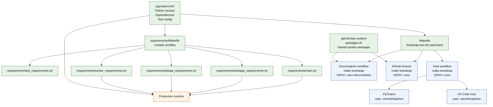

# Environment Workflow Equivalence

This repository is designed so that PyCharm, VS Code, devcontainers, GitHub Actions, and production-oriented installs all derive from the same small set of source-of-truth files.

The important point is not that every environment is byte-for-byte identical. They are not. The important point is that they are intentionally equivalent at the contract level:

- The Python version comes from `pyproject.toml`.
- The dependency graph comes from `pyproject.toml`.
- The lockfiles are generated from `pyproject.toml` by `requirements/Makefile`.
- The developer bootstrap entrypoint is `make bootstrap`.
- The main test, lint, and typecheck commands come from `Makefile`.
- CI and the devcontainer reuse the same repo-owned package list where possible.

That gives each environment a different wrapper around the same project workflow instead of five unrelated workflows.

## The Shared Contract

These files define most of the behavior:

- `pyproject.toml`
  - Defines the required Python version: `>=3.13,<3.14`
  - Defines the base dependencies and optional dependency groups
  - Defines tool configuration for Ruff, mypy, pytest, and ty
- `Makefile`
  - Defines `bootstrap_venv`, `bootstrap`, `test`, `lint`, `reformat`, and `typecheck`
  - Makes `uv` the installer frontend for bootstrap
- `requirements/Makefile`
  - Compiles the lockfiles from `pyproject.toml`
  - Produces runtime-specific lockfiles such as `main.txt`, `webapp_requirements.txt`, `worker_requirements.txt`, and `fastapi_requirements.txt`
- `.github/repo-system-packages.sh`
  - Defines the shared apt-level packages used by CI and the devcontainer
- `.devcontainer/devcontainer.json`
  - Runs the same bootstrap flow as local development, but in `.venv-devcontainer`
- `.github/workflows/run-tests.yaml`
  - Uses the same repo bootstrap and the same `Makefile` targets in GitHub Actions

## How Each Environment Uses The Same Workflow

### PyCharm on the host

PyCharm is just a frontend over the host virtualenv. The repo expects the interpreter to be `.venv/bin/python` after:

```bash
make bootstrap
```

That command:

1. Uses `uv venv` to create `.venv`
2. Reads the Python requirement from `pyproject.toml`
3. Installs `requirements/test_requirements.txt` with hash verification
4. Installs the repo itself in editable mode with `uv pip install -e .`

Once PyCharm points at `.venv/bin/python`, imports, tests, and type checking all run against the same environment the shell uses.

### VS Code on the host

VS Code is the same host workflow with a repo-supplied default interpreter. `.vscode/settings.json` points the Python extension at `.venv/bin/python` and enables pytest discovery under `src`.

So the IDE-specific part is small:

- VS Code chooses the interpreter
- The repo bootstrap still creates and populates that interpreter
- The same `Makefile` commands still drive test, lint, and typecheck behavior

In practice, PyCharm and VS Code are equivalent here. They are two UIs attached to the same `.venv`-based development environment.

### VS Code devcontainer

The devcontainer changes the operating system wrapper, not the project workflow.

Its Dockerfile:

- Starts from a Debian base image that is expected to stay aligned with production
- Installs `uv`
- Installs the same shared repo system packages from `.github/repo-system-packages.sh`
- Installs Docker tooling so the test suite can talk to the host Docker socket

Its `postCreateCommand` then runs:

```bash
make bootstrap VENV=.venv-devcontainer
```

That means the devcontainer is equivalent to host development in structure:

- Same repository
- Same `pyproject.toml`
- Same lockfile-based bootstrap
- Same editable install model
- Same `Makefile` commands

The only meaningful differences are:

- The interpreter lives in `.venv-devcontainer` instead of `.venv`
- The OS packages come from the container image instead of the host machine
- VS Code stores interpreter selection separately for the host window and the devcontainer window

### GitHub Actions CI

The main CI workflow in `.github/workflows/run-tests.yaml` reproduces the same bootstrap path on a GitHub runner.

It does this by:

1. Checking out the repo
2. Selecting Python from `pyproject.toml`
3. Installing repo-owned system packages from `.github/repo-system-packages.sh`
4. Installing `uv`
5. Running `make bootstrap VENV=.venv`
6. Activating `.venv`
7. Running `make test` or `make typecheck`

This is the strongest equivalence in the repo because it is literal command reuse. CI does not have a special hidden setup script for the main validation jobs; it runs the same bootstrap target and the same `Makefile` commands developers run locally.

There is also a separate CodeQL workflow in `.github/workflows/codeql-analysis.yml`. That workflow is not the same as the bootstrap-driven test workflow. It is static analysis infrastructure, not the primary runtime or developer environment contract.

### Production

Production is only partially represented in this repository. The repo does not contain a full deployment stack for production, such as service manifests, orchestration definitions, or a complete runtime image build pipeline.

So the correct statement is:

- Production is not fully described here
- Production compatibility is still shaped by the same repo contract

The production-facing equivalents that do exist in this repo are:

- `pyproject.toml` remains the source of truth for the Python version and dependency definitions
- `requirements/Makefile` generates the runtime lockfiles from that same source of truth
- The devcontainer base image is explicitly expected to track the production base image family
- The shared system package list shows binaries the Python stack depends on, such as `xmlsec1` and `ghostscript`

The main difference is scope:

- Developer and CI bootstrap install the full test-oriented environment from `requirements/test_requirements.txt`
- Production should normally install only the runtime slice it needs, such as `main.txt`, `webapp_requirements.txt`, `worker_requirements.txt`, or `fastapi_requirements.txt`

So production is equivalent by definition source, not by package volume. It is a narrower environment built from the same dependency model.

## Diagram



## Equivalence Summary

If you reduce each environment to its core behavior, the mapping looks like this:

| Environment | Python source | Dependency source | Bootstrap command | Active interpreter | Main purpose |
| --- | --- | --- | --- | --- | --- |
| PyCharm host | `pyproject.toml` | `requirements/test_requirements.txt` | `make bootstrap` | `.venv/bin/python` | Local development |
| VS Code host | `pyproject.toml` | `requirements/test_requirements.txt` | `make bootstrap` | `.venv/bin/python` | Local development |
| Devcontainer | `pyproject.toml` | `requirements/test_requirements.txt` | `make bootstrap VENV=.venv-devcontainer` | `.venv-devcontainer/bin/python` | Reproducible local development |
| GitHub Actions | `pyproject.toml` | `requirements/test_requirements.txt` | `make bootstrap VENV=.venv` | `.venv/bin/python` | Verification |
| Production | `pyproject.toml` | runtime lockfiles from `requirements/Makefile` | deployment-specific | deployment-specific | Runtime execution |

## Short Version

PyCharm and VS Code are equivalent because both are expected to point at the same host virtualenv.

The devcontainer is equivalent because it runs the same repo bootstrap and the same `Makefile` commands, but inside a container and with a separate virtualenv path.

GitHub Actions is equivalent because it literally reuses the same bootstrap target and validation commands on a clean runner.

Production is equivalent more narrowly: it should be built from the same Python and dependency definitions, but with runtime-only lockfiles rather than the full development and test environment.